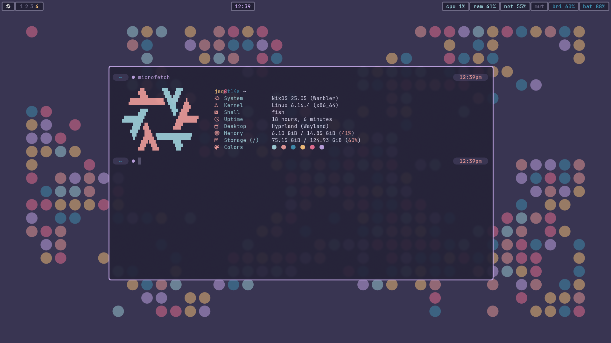

# dots

## About

My current Linux setup, running NixOS + Hyprland.

  

## Acknowledgements

It's honestly funny how hard I dove off the deep-end into the NixOS rabbit hole. Getting a stable, working configuration that does exactly what I want, how I want it, would have been impossible without the resources listed [here](./CREDITS.md).
